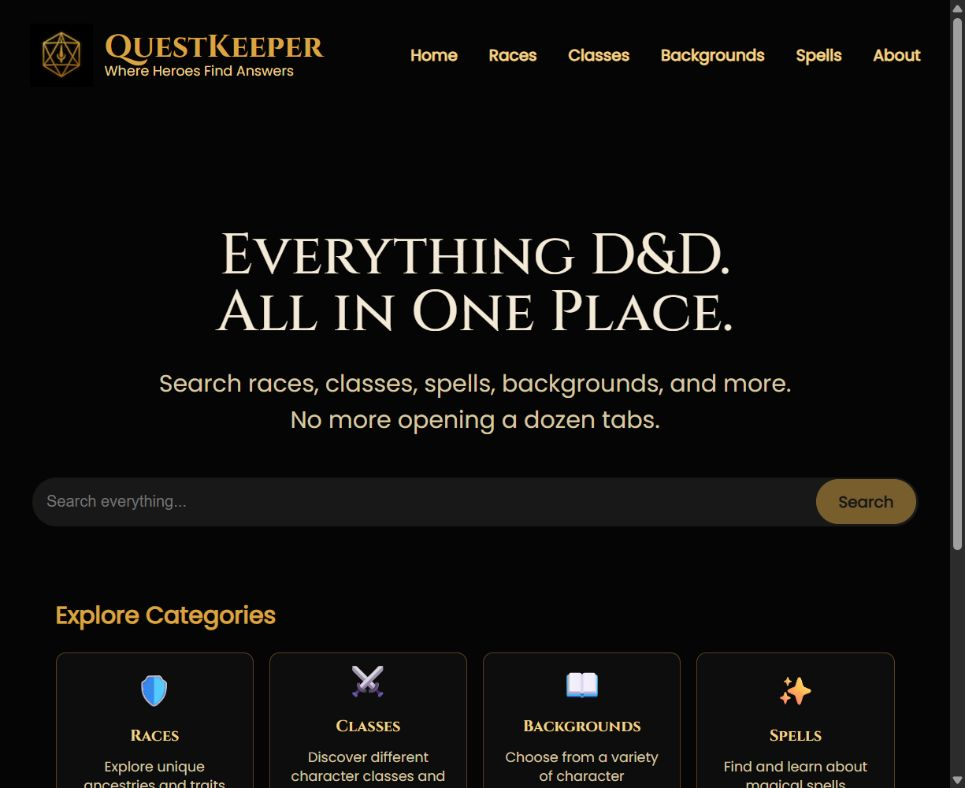

# QuestKeeper

QuestKeeper is a full-stack reference companion for the **2014 version of Dungeons & Dragons Fifth Edition**. It gives players one searchable interface for classes, races, spells, and backgrounds instead of making them jump between reference pages.

[View the source on GitHub](https://github.com/samanthaparas/QuestKeeper) · Live demo link coming after deployment

## Screenshots

### Search and browse



### API-driven result details


## Features

- Global search across classes, races, spells, and backgrounds.
- Dedicated category browsing pages.
- Selectable result cards with an in-page detail panel.
- Loading, empty, and error feedback for API-driven views.
- Responsive navigation and a mobile result-to-detail flow.
- Reusable React components for search, cards, navigation, and details.

## Tech stack

| Area | Technology |
| --- | --- |
| Frontend | React 19, React Router, Vite, CSS |
| Backend | Node.js, Express, REST routes |
| Data | D&D 5e SRD API (2014 endpoints) |
| Repository | npm workspaces monorepo |

The project is being developed incrementally toward accounts, saved content, character sheets, gameplay tracking, and guided character progression. For the complete product direction, content policy, and development milestones, see [QuestKeeper Project Vision](docs/QUESTKEEPER_VISION.md).

## Current implementation

QuestKeeper currently includes:

- A React and Vite frontend.
- An Express backend.
- Category pages for classes, races, spells, and backgrounds.
- Global search across the available categories.
- Detail panels for individual results.
- A backend connection to the D&D 5e SRD API's 2014 endpoints.
- Root npm workspace commands for running both applications from the monorepo.

This is an active learning project. Some features are intentionally simple while the architecture and data policies are developed step by step.

## Project structure

```text
QuestKeeper/
|-- docs/
|   `-- QUESTKEEPER_VISION.md    Product vision and development direction
|-- questkeeper-backend/
|   |-- src/controllers/         Requests and transforms upstream API data
|   |-- src/routes/              Express API routes
|   `-- src/server.js            Backend entry point
|-- questkeeper-frontend/
|   |-- public/                  Static public assets
|   `-- src/
|       |-- components/          Reusable interface components
|       |-- pages/               Page-level React components
|       `-- utils/api.js         Frontend API request functions
|-- package.json                 Shared workspace commands
`-- README.md
```

The frontend and backend retain separate `package.json` files because they have different dependencies. The root `package.json` defines npm workspaces and convenient commands for both applications.

The applications originally lived in separate repositories. They were combined into this monorepo when features began requiring coordinated frontend and backend changes.

## How the applications communicate

```text
React frontend
    -> QuestKeeper Express backend
    -> D&D 5e SRD API (2014)
```

The frontend normally requests data from `http://localhost:3001/api`. The Express backend then requests the appropriate 2014 resource from `https://www.dnd5eapi.co/api/2014` and returns it in a consistent `{ data: ... }` response.

Keeping the external API behind the QuestKeeper backend creates a place to add validation, caching, source information, normalized data, accounts, and character data later.

## Local setup

### Prerequisites

- A current Node.js version that supports the built-in `fetch` API.
- npm.
- Git.

### Install dependencies

From the repository root:

```powershell
npm install
```

### Run the backend

Open a terminal in the repository root and run:

```powershell
npm run dev:backend
```

The backend listens on:

```text
http://localhost:3001
```

### Run the frontend

Open a second terminal in the repository root and run:

```powershell
npm run dev:frontend
```

Vite will print the frontend's local URL in the terminal.

### Frontend API configuration

The frontend defaults to the local backend at `http://localhost:3001/api`. To use another backend, copy the frontend environment example and set the desired URL:

```text
questkeeper-frontend/.env.example
```

Environment variable:

```text
VITE_API_BASE_URL=http://localhost:3001/api
```

Restart the Vite development server after changing an environment variable.

## Deployment

The repository includes a [`render.yaml`](render.yaml) Blueprint that defines both applications:

- `questkeeper-api`: a Node/Express web service.
- `questkeeper`: a Vite static site with a single-page app rewrite.

To deploy it on Render:

1. Push this repository to GitHub.
2. In Render, choose **New > Blueprint** and connect the repository.
3. When prompted for `VITE_API_BASE_URL`, use the deployed backend URL with `/api` appended, for example `https://questkeeper-api.onrender.com/api`.
4. After both services deploy, open the frontend and test a search and a detail panel.
5. Replace the pending live-demo text at the top of this README with the verified frontend URL.

The backend reads the host-provided `PORT`. No API keys or secrets are required. The API currently allows cross-origin requests because it exposes only public SRD reference data; a future authenticated version should restrict allowed origins.

## Available commands

Run these commands from the repository root:

| Command | Purpose |
| --- | --- |
| `npm run dev:frontend` | Start the Vite frontend development server |
| `npm run dev:backend` | Start the Express backend with automatic restarts |
| `npm run start:backend` | Start the Express backend without Nodemon |
| `npm run build` | Create a production frontend build |
| `npm run lint` | Check the frontend source with ESLint |

Automated tests have not been added yet.

## Problems encountered and current solutions

### The frontend and backend began as separate repositories

**Problem:** Developing one feature could require coordinating two repositories, two histories, and separate Git workflows.

**Current solution:** Both applications were combined into this monorepo while preserving their existing files and Git history. A root workspace package now provides shared development commands, and the repository is connected to the QuestKeeper GitHub remote.

### Search required unnecessary navigation

**Problem:** The original search interaction made it harder to move directly from a query to useful results.

**Current solution:** Search submission and routing were improved so searches lead into the global results experience more naturally. Search results from all current content categories are formatted into a shared card and detail-panel interface.

### Only one background appears

**Problem:** The backgrounds page displays only Acolyte, which can look like an application or filtering error.

**Current solution:** The data path was audited. QuestKeeper does not remove any background results; the upstream 2014 SRD source contains only Acolyte. Adding other backgrounds is therefore a content-source and licensing decision rather than a frontend bug fix.

### Public D&D websites contain content that may not be reusable

**Problem:** Material being publicly readable does not automatically mean QuestKeeper may copy and redistribute it. Attribution alone does not grant that permission.

**Current solution:** QuestKeeper will use content only after reviewing its source, edition, coverage, license, and terms. It will not use Wikidot or similar websites as an unverified database. The project may instead use reusable material, original explanations, authorized external links, and private user-entered notes.

### Local and deployed environments need different backend URLs

**Problem:** The local frontend expects a backend on `localhost`, which will not work for a publicly deployed frontend.

**Current solution:** The frontend supports `VITE_API_BASE_URL`. A deployed environment will need that variable set to the deployed QuestKeeper backend URL.

## Known limitations

- Content is limited to what the current 2014 SRD API provides.
- Background coverage currently includes only Acolyte.
- Source, edition, license, and attribution metadata are not yet shown for individual entries.
- Global search depends on all category requests succeeding together.
- Upstream requests do not yet use application-level caching or explicit timeouts.
- Accounts, favorites, character sheets, and gameplay tracking are not implemented.
- Automated frontend and backend tests are not implemented.
- A public deployment has not yet been verified.

## Planned development

The current high-level sequence is:

1. Keep the architecture, vision, setup, and content policies documented.
2. Improve search and browsing for approved reusable data.
3. Add normalized backend models and source provenance.
4. Add response validation, caching, timeouts, and automated tests.
5. Add accounts, favorites, and saved content.
6. Build a basic character sheet with statistics and hit point tracking.
7. Add inventory, equipment, and spell management.
8. Add guided character creation and level-up choices.
9. Explore AI-assisted character recommendations after the underlying rules and character data are reliable.

The roadmap is intentionally incremental. Each feature should be small enough to understand, implement, test, and review before moving to the next one.

## Content and licensing principles

QuestKeeper targets the 2014 rules, but it should not silently mix editions or reproduce protected material without permission.

When adding a source, document:

- Its rules edition.
- Who provides it.
- What original material it uses.
- Its license and attribution requirements.
- Which categories and books it covers.
- Whether QuestKeeper may reproduce the text, link to it, or store only private user notes.

The detailed policy and proposed provenance fields are recorded in [docs/QUESTKEEPER_VISION.md](docs/QUESTKEEPER_VISION.md).

## Git workflow

Before staging anything, inspect the working tree:

```powershell
git status
```

Stage only the files that belong to the change when practical:

```powershell
git add README.md docs/QUESTKEEPER_VISION.md
git status
git commit -m "Document QuestKeeper vision and roadmap"
git push
```

`git add .` stages every changed file below the current directory. Always review `git status` first so unrelated work is not included accidentally.

## Repository history

The frontend and backend originally lived in separate repositories. Their histories were imported into this monorepo, which is now maintained at:

<https://github.com/samanthaparas/QuestKeeper>
