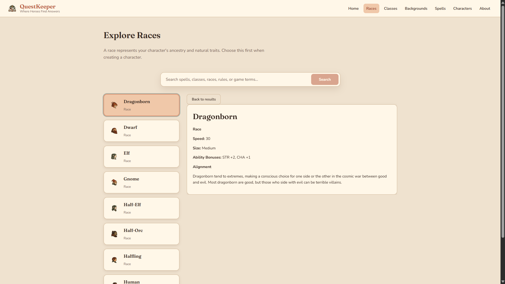
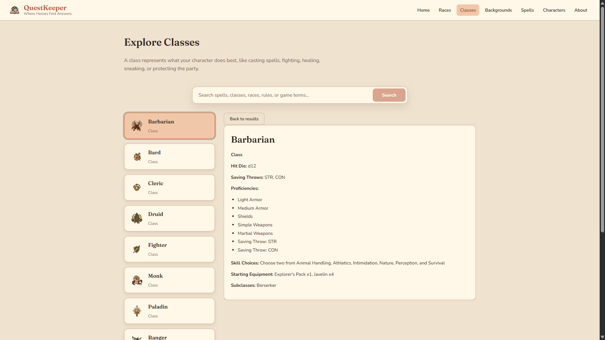
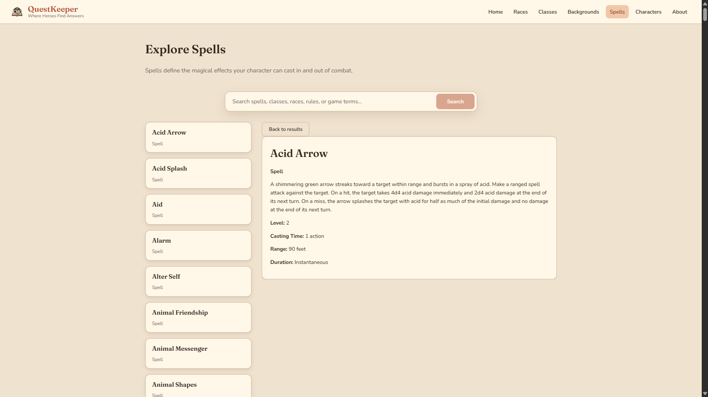
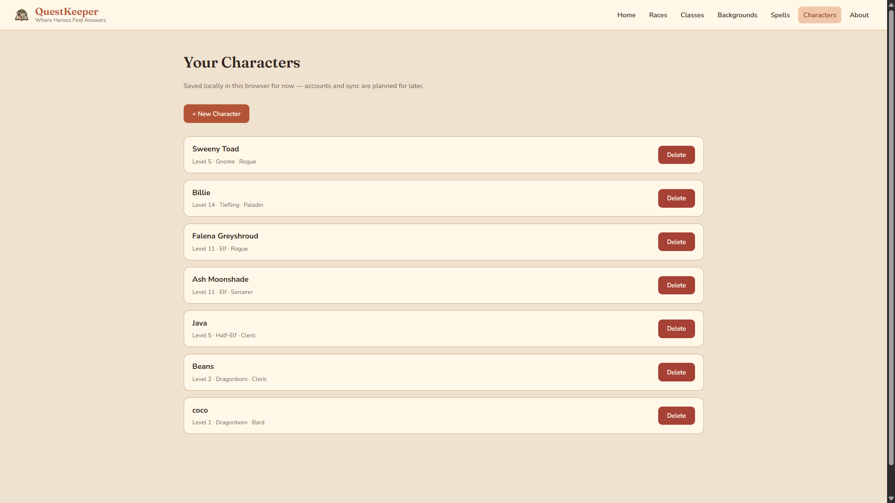
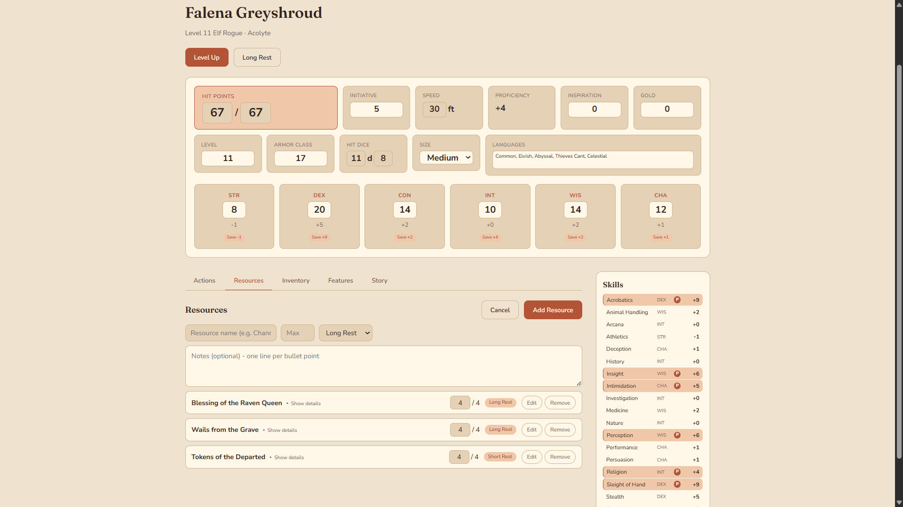
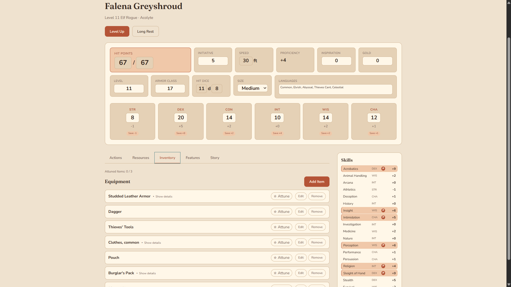

# QuestKeeper

QuestKeeper is a full-stack companion for the **2014 version of Dungeons & Dragons Fifth Edition**. It gives players one searchable interface for classes, races, spells, and backgrounds instead of making them jump between reference pages, and it pairs that reference lookup with a guided character sheet builder — creation, leveling, and full manual editing — so a character's stats stay one click away during actual play.

[Live Demo](https://questkeeper-it0i.onrender.com) · [Source Code](https://github.com/samanthaparas/QuestKeeper)

## Screenshots

### Home


### Reference pages







### Your Characters



### Character sheet





## Features

- Global search across classes, races, spells, and backgrounds, plus dedicated category browsing pages.
- Selectable result cards with an in-page detail panel, including race/class/background icons.
- Guided character creation wizard — Name, Race (with subraces), Class (with subclasses where the SRD grants one at level 1), Background, class skill and starting-spell choices, and ability scores — with a persistent step rail and a live "Your Hero So Far" summary panel, and real derived starting stats (HP, AC, initiative, speed, saving throws) instead of flat defaults.
- A tabbed character sheet (Actions, Spells, Resources, Inventory, Features, Story) with a persistent combat header (HP, AC, initiative, speed, ability scores) and a sticky Skills sidebar, so a tab you don't need — like Spells, for a non-caster — simply isn't there.
- A full level-up flow: hit points (roll, take average, or enter a physical dice result), ability score improvements or feats, subclass selection at the correct level per class, and new-spell learning, with your current stats shown on every step.
- Manual tracking for equipment (with attunement, capped at 3 items), attacks, feats, features, proficiencies, and per-rest limited-use resources, plus a dedicated per-level spell slot tracker — all editable after creation, not just at creation time.
- Spell name autocomplete when adding a spell, with Level and Components auto-filled from the SRD the moment you pick or type an exact match; homebrew spells still work as plain freeform entries.
- A trackable Companion mini stat block (name, AC, speed, HP, notes) as an alternative to freeform text, toggleable per-character without losing whichever mode you're not currently using.
- A show/hide toggle for the Backstory section, for characters that don't need it visible.
- A warm, parchment-and-terracotta visual design ("Wayfarer") applied consistently across the whole app, built on a shared CSS token system and a shared `Button` component.
- Loading, empty, and error feedback for API-driven views, and a responsive/mobile result-to-detail flow on every reference page.

## Tech stack

| Area       | Technology                        |
| ---------- | --------------------------------- |
| Frontend   | React 19, React Router, Vite, CSS |
| Backend    | Node.js, Express, REST routes     |
| Testing    | Vitest                            |
| Data       | D&D 5e SRD API (2014 endpoints)   |
| Repository | npm workspaces monorepo           |

The project is being developed incrementally toward accounts, saved content, and further gameplay tracking. Character sheets (creation, leveling, and full manual editing) are already built and stored locally per browser. For the complete product direction, content policy, and development milestones, see [QuestKeeper Project Vision](docs/QUESTKEEPER_VISION.md).

## Current implementation

QuestKeeper currently includes:

- A React and Vite frontend, restyled end-to-end in a shared "Wayfarer" visual design (color/type/spacing tokens in `index.css`, a shared `Button` component).
- An Express backend.
- Category pages for classes, races, spells, and backgrounds, all sharing a common `ResultCard`/`DetailPanel` layout.
- Global search across the available categories.
- A guided character creation wizard (with subraces and level-1 subclasses where applicable) and a tabbed character sheet page covering stats, skills, spellcasting (including a spell slot tracker and spell autocomplete), attacks, equipment, feats, features, proficiencies, resources, and a Story tab (backstory, appearance, companion, notes) — all directly editable after creation.
- A level-up flow for existing characters (hit points, ability score improvements or feats, subclass selection, new spells).
- A backend connection to the D&D 5e SRD API's 2014 endpoints.
- Root npm workspace commands for running both applications from the monorepo.
- A growing Vitest suite covering the character sheet's pure game-logic functions.

QuestKeeper is actively developed, with features added incrementally so the architecture, data sources, and user experience can evolve deliberately.

## Project structure

```text
QuestKeeper/
|-- docs/
|   |-- QUESTKEEPER_VISION.md    Product vision and development direction
|   `-- screenshots/             README screenshots
|-- questkeeper-backend/
|   |-- src/controllers/         Requests and transforms upstream API data
|   |-- src/routes/              Express API routes
|   `-- src/server.js            Backend entry point
|-- questkeeper-frontend/
|   |-- public/                  Static public assets
|   `-- src/
|       |-- components/          Reusable interface components
|       |-- pages/               Page-level React components
|       `-- utils/api.js         Frontend API request functions
|-- package.json                 Shared workspace commands
`-- README.md
```

The frontend and backend retain separate `package.json` files because they have different dependencies. The root `package.json` defines npm workspaces and convenient commands for both applications.

The applications originally lived in separate repositories. They were combined into this monorepo when features began requiring coordinated frontend and backend changes.

## How the applications communicate

```text
React frontend
    -> QuestKeeper Express backend
    -> D&D 5e SRD API (2014)
```

The frontend normally requests data from `http://localhost:3001/api`. The Express backend then requests the appropriate 2014 resource from `https://www.dnd5eapi.co/api/2014` and returns it in a consistent `{ data: ... }` response.

Keeping the external API behind the QuestKeeper backend creates a place to add validation, caching, source information, normalized data, accounts, and character data later.

## Local setup

### Prerequisites

- A current Node.js version that supports the built-in `fetch` API.
- npm.
- Git.

### Install dependencies

From the repository root:

```powershell
npm install
```

### Run the backend

Open a terminal in the repository root and run:

```powershell
npm run dev:backend
```

The backend listens on:

```text
http://localhost:3001
```

### Run the frontend

Open a second terminal in the repository root and run:

```powershell
npm run dev:frontend
```

Vite will print the frontend's local URL in the terminal.

### Frontend API configuration

The frontend defaults to the local backend at `http://localhost:3001/api`. To use another backend, copy the frontend environment example and set the desired URL:

```text
questkeeper-frontend/.env.example
```

Environment variable:

```text
VITE_API_BASE_URL=http://localhost:3001/api
```

Restart the Vite development server after changing an environment variable.

## Deployment

QuestKeeper is deployed on Render:

- [Frontend demo](https://questkeeper-it0i.onrender.com)
- [Backend API](https://questkeeper-api.onrender.com)

The repository includes a [`render.yaml`](render.yaml) Blueprint that defines both services:

- `questkeeper-api`: a Node/Express web service.
- `questkeeper`: a Vite static site with a single-page app rewrite.

The deployed frontend uses `VITE_API_BASE_URL=https://questkeeper-api.onrender.com/api`. The backend reads Render's host-provided `PORT`, and no API keys or secrets are required. The API currently allows cross-origin requests because it exposes only public SRD reference data; a future authenticated version should restrict allowed origins.

## Available commands

Run these commands from the repository root:

| Command                                                | Purpose                                           |
| ------------------------------------------------------ | ------------------------------------------------- |
| `npm run dev:frontend`                                 | Start the Vite frontend development server        |
| `npm run dev:backend`                                  | Start the Express backend with automatic restarts |
| `npm run start:backend`                                | Start the Express backend without Nodemon         |
| `npm run build`                                        | Create a production frontend build                |
| `npm run lint`                                         | Check the frontend source with ESLint             |
| `npm run test --workspace questkeeper-frontend -- run` | Run the Vitest suite once                         |

Automated tests cover the character sheet's pure functions (ability scores, hit points, level-up, resources, rests, companion creatures). Backend and component-level tests have not been added yet. A GitHub Actions workflow (`.github/workflows/ci.yml`) runs lint, test, and build on every push and pull request to `main`.

## Engineering decisions and challenges

### The frontend and backend began as separate repositories

**Problem:** Developing one feature could require coordinating two repositories, two histories, and separate Git workflows.

**Current solution:** Both applications were combined into this monorepo while preserving their existing files and Git history. A root workspace package now provides shared development commands, and the repository is connected to the QuestKeeper GitHub remote.

### Search required unnecessary navigation

**Problem:** The original search interaction made it harder to move directly from a query to useful results.

**Current solution:** Search submission and routing were improved so searches lead into the global results experience more naturally. Search results from all current content categories are formatted into a shared card and detail-panel interface.

### Only one background appears

**Problem:** The backgrounds page displays only Acolyte, which can look like an application or filtering error.

**Current solution:** The data path was audited. QuestKeeper does not remove any background results; the upstream 2014 SRD source contains only Acolyte. Adding other backgrounds is therefore a content-source and licensing decision rather than a frontend bug fix. The backend already supports an opt-in `?edition=2024` query for backgrounds and feats (4 backgrounds, 17 feats), scaffolded for a future licensing-verified expansion, but it isn't wired into the frontend yet.

### The character sheet needed to support real, messy, homebrew characters

**Problem:** A guided creation wizard tied to SRD data works well for starting a new character, but real, actively-played characters accumulate content the SRD doesn't have — homebrew magic items, DM-granted resources, non-SRD feats — and need every stat editable as the character changes, not just at creation.

**Current solution:** The character sheet page supports direct editing of every core stat, plus freeform (non-SRD-linked) add/edit/remove for equipment, attacks, feats, features, proficiencies, and spells, each with an optional multi-line notes field rendered as bullet points. A generic `EditableItemList` component backs every one of those sections so the same add/edit/remove/confirm-before-delete behavior isn't reimplemented per section — it also now supports optional autocomplete (a native `<datalist>`) and cross-field autofill for sections with a real SRD data source, currently used by Spells.

### A single scrolling character sheet became unwieldy

**Problem:** As more sections were added (attacks, spellcasting, resources, equipment, feats, features, proficiencies, backstory, appearance, companion, notes), the character sheet became one very long page, and sections that didn't apply to a given character (like spellcasting for a Fighter) still had to be scrolled past.

**Current solution:** The sheet was restructured into a persistent combat header (stats that matter regardless of what you're doing) plus six tabs (Actions, Spells, Resources, Inventory, Features, Story), with a sticky Skills sidebar visible from any tab. A tab that doesn't apply — Spells, for a character with no spellcasting — simply isn't rendered, which turned out to be a simpler mechanism than a per-section show/hide toggle system.

### Public D&D websites contain content that may not be reusable

**Problem:** Material being publicly readable does not automatically mean QuestKeeper may copy and redistribute it. Attribution alone does not grant that permission.

**Current solution:** QuestKeeper will use content only after reviewing its source, edition, coverage, license, and terms. It will not use Wikidot or similar websites as an unverified database. The project may instead use reusable material, original explanations, authorized external links, and private user-entered notes.

### Local and deployed environments need different backend URLs

**Problem:** The local frontend expects a backend on `localhost`, which will not work for a publicly deployed frontend.

**Current solution:** The frontend supports `VITE_API_BASE_URL`. In local development, it defaults to `http://localhost:3001/api`. The deployed Render frontend is configured to use `https://questkeeper-api.onrender.com/api`, allowing the same frontend codebase to work correctly in both local and production environments.

## Known limitations

- Content is limited to what the current 2014 SRD API provides by default.
- Background coverage currently includes only Acolyte in the default (2014) view; the backend can serve 4 backgrounds and 17 feats from the 2024 SRD via an opt-in query parameter, but the frontend doesn't expose that yet.
- Source, edition, license, and attribution metadata are not yet shown for individual entries.
- Global search depends on all category requests succeeding together.
- Upstream requests do not yet use application-level caching or explicit timeouts.
- Character sheets are stored in the browser's local storage only — there are no accounts or cross-device sync yet.
- Equipment/proficiency _choices_ (e.g. "a martial weapon or two simple weapons") aren't modeled during guided creation; only guaranteed starting gear is, plus freeform manual entry for anything else.
- Spell slots are a manual max/current tracker, not auto-computed from class and level — the level-up flow adds a learned spell to your known list but doesn't update slot counts, since that needs real per-class (and per-Warlock-Pact-Magic) progression tables.
- Weapon/equipment autocomplete doesn't exist yet — spell autocomplete does, since spell data was already available; weapons would need a new backend endpoint.
- Test coverage is limited to the frontend's pure game-logic functions — no backend or component/UI tests yet.
- The free backend service may take approximately a minute to wake after a period of inactivity.

## Planned development

The current high-level sequence is:

1. Keep the architecture, vision, setup, and content policies documented.
2. Model equipment/proficiency choices during guided creation (currently requires a manual workaround), and build real per-class spell slot progression so leveling up updates slot counts automatically.
3. Wire the existing 2024-SRD background/feat support into the frontend, and add more legally-sourced content as it's reviewed.
4. Add normalized backend models, source provenance, response validation, caching, and timeouts.
5. Expand automated test coverage to the backend and to UI components, not just pure functions.
6. Add accounts, favorites, and cross-device saved content (character sheets currently live in localStorage only).
7. Extend the Companion mini stat block toward richer tracking (attacks/spells of its own) if that turns out to be worth the complexity versus the current lightweight stat block, and build weapon autocomplete alongside a dedicated equipment/weapons backend endpoint.
8. Explore AI-assisted character recommendations after the underlying rules and character data are reliable.

The roadmap is intentionally incremental. Each feature should be small enough to understand, implement, test, and review before moving to the next one.

## Content and licensing principles

QuestKeeper targets the 2014 rules, but it should not silently mix editions or reproduce protected material without permission.

When adding a source, document:

- Its rules edition.
- Who provides it.
- What original material it uses.
- Its license and attribution requirements.
- Which categories and books it covers.
- Whether QuestKeeper may reproduce the text, link to it, or store only private user notes.

The detailed policy and proposed provenance fields are recorded in [docs/QUESTKEEPER_VISION.md](docs/QUESTKEEPER_VISION.md).
