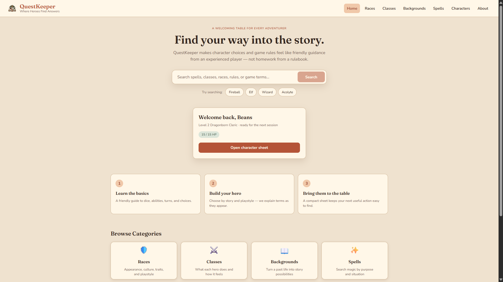
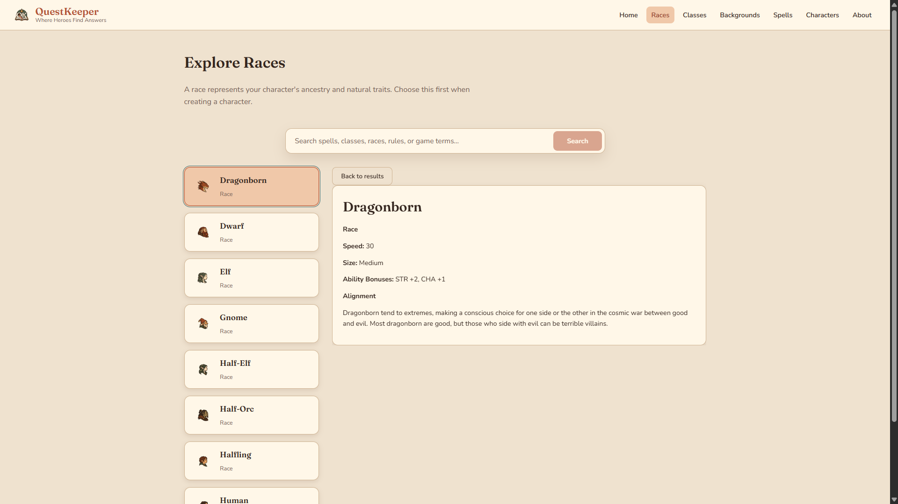
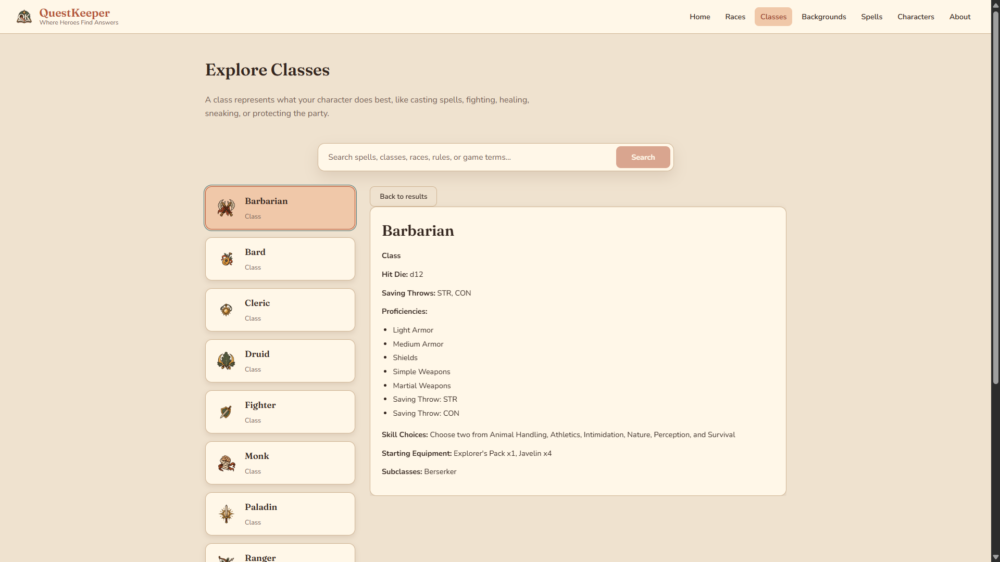
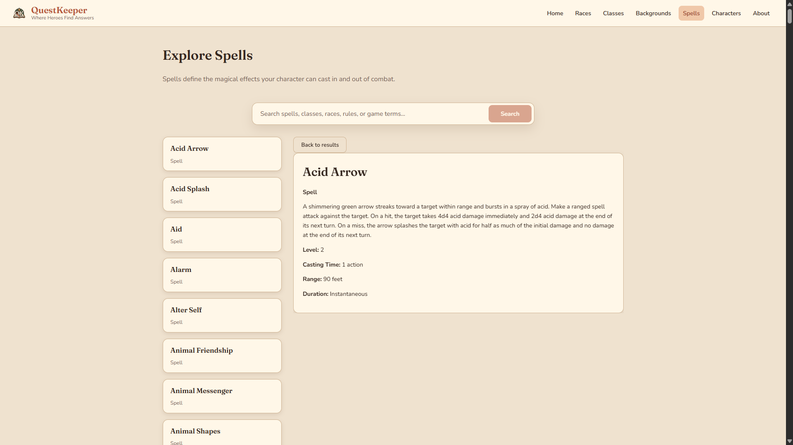
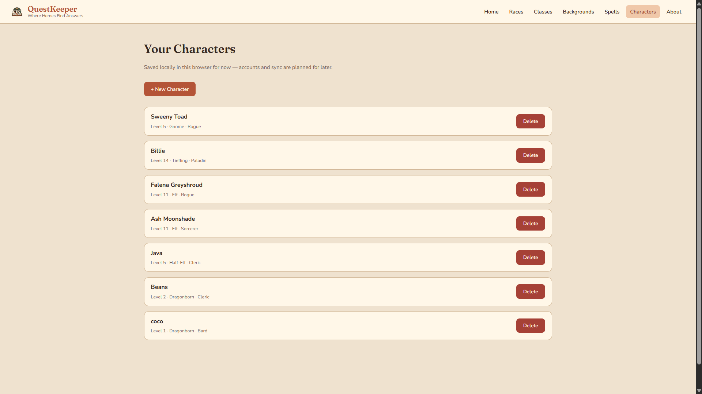
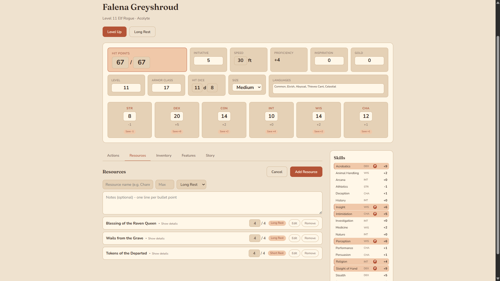
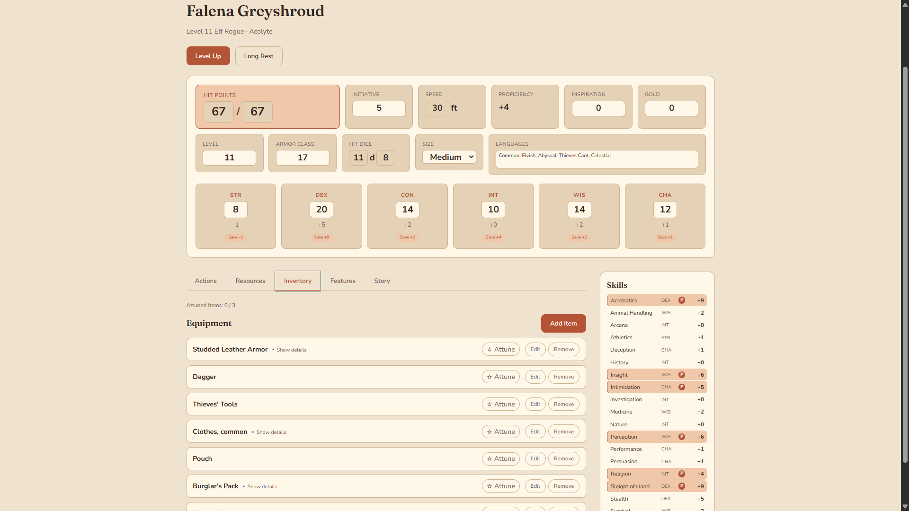

# QuestKeeper

QuestKeeper is a full-stack companion for **Dungeons & Dragons Fifth Edition**, built on the freely licensed 2014 SRD with select 2024 SRD content. It gives players one searchable interface for classes, races, spells, and backgrounds instead of making them jump between reference pages, and it pairs that reference lookup with a guided character sheet builder — creation, leveling, and full manual editing, saved to your account — so a character's stats stay one click away during actual play.

[Live Demo](https://questkeeper-it0i.onrender.com) · [Source Code](https://github.com/samanthaparas/QuestKeeper)

## Screenshots

### Home



### Reference pages







### Your Characters



### Character sheet





## Features

- Global search across classes, races, spells, and backgrounds, plus dedicated category browsing pages.
- Selectable result cards with an in-page detail panel, including race/class/background icons.
- A guided character creation wizard for first-time players: the steps run as a row across the top, a slim "Your hero so far" strip fills in as you go, and the detail cards get the full page width. Every race and class has a plain-language "Good if you want..." line (classes also show a role and difficulty), every starting spell has a one-line summary and a Read more button for its full text, and each narrow step has a Tips card with class-specific advice. Options you can't pick are clearly marked as locked.
- A Review page that reads like a character introduction: a card per section (who they are, ability scores, skills, magic, gear), a Change button on each that returns straight to Review, and a list of anything still missing before the character can be created.
- A Gear step where each class's either/or starting equipment is chosen ("chain mail, or leather armor, a longbow and 20 arrows"), including "any martial weapon" style picks from the SRD's item lists.
- New characters arrive with real derived starting stats: AC from the armor and shield they wear, attacks worked out from their starting weapons and proficiencies, languages, class proficiencies, racial traits, and level 1 class features, instead of flat defaults.
- A tabbed character sheet (Actions, Spells, Resources, Inventory, Features, Story) with a persistent combat header (HP, AC, initiative, speed, ability scores) and a sticky Skills sidebar, so a tab you don't need — like Spells, for a non-caster — simply isn't there.
- A full level-up flow: hit points (roll, take average, or enter a physical dice result), ability score improvements (capped at 20) or feats, subclass selection at the correct level per class, and new-spell learning, with your current stats shown on every step.
- Rests that follow the rules: a Short Rest spends Hit Dice to heal (each die plus your Constitution modifier) and refills short-rest abilities; a Long Rest restores HP and spell slots and gives back half your Hit Dice. Each rest says what it changed.
- Manual tracking for equipment (with attunement, capped at 3 items), attacks, feats, features, proficiencies, and per-rest limited-use resources, plus a dedicated per-level spell slot tracker — all editable after creation, not just at creation time.
- Spell name autocomplete when adding a spell, with Level and Components auto-filled from the SRD the moment you pick or type an exact match; homebrew spells still work as plain freeform entries. Spells granted by your race arrive locked (🔒 "From your race") so they can't be swapped or deleted by accident, and any spell can be locked or unlocked.
- A trackable Companion mini stat block (name, AC, speed, HP, notes) as an alternative to freeform text, toggleable per-character without losing whichever mode you're not currently using.
- A show/hide toggle for the Backstory section, for characters that don't need it visible.
- Accounts (sign up, log in, session persistence) with character sheets saved to your account and a portrait upload for each character.
- Spell slots computed from class and level at creation and level-up, temporary HP tracking, and tap-to-toggle skill and item proficiencies.
- Weapon autocomplete with damage autofill and a to-hit ability hint, alongside spell autocomplete.
- Race, class, and spell pages show what a player actually needs to choose: every racial trait with its text, the features you get at level 1 and what comes later, how the class casts spells, and full spell details (school, components, concentration, classes, higher-level scaling, and tables).
- Tap any spell, feat, weapon, magic item, class feature, or racial trait for its full SRD details in a popup, including real tables.
- Flat bonuses that real sheets need: a bonus to all saves (Paladin's Aura of Protection), per-skill bonuses, skill expertise, and a temporary AC bonus (Haste). Race, class, subclass, background, and spellcasting ability can all be retyped, so homebrew and non-SRD characters can match a paper sheet, and an "Add from my class and race" picker writes SRD class features and racial traits onto the sheet.
- Tables for live play: a DM creates a table with a join code, and players join with one of their characters. The DM gets a read-only view of every sheet, an initiative tracker, and a private Monster Library; every player sees a turn banner on their own sheet. Enemy HP and AC stay hidden (players see a name, Bloodied or Down, and damage taken).
- A full attack flow: a player rolls a virtual d20 or types a physical roll, and the database decides hit or miss against the secret AC. The DM can run attacks for monsters and allies from their stat blocks, send damage to a player as a request they apply on their own sheet, deny an attack, track friendly NPCs by hand, add many identical monsters at once with nicknames and icons, and roll initiative for every monster in one click while still rolling a boss with real dice.
- The 2024 SRD's backgrounds and feats in browsing and the level-up flow, labeled by edition, with a full SRD attribution on the About page.
- A "Learn the Basics" guide with an interactive dice roller, and ability score explanations plus a 4d6 roll-for-stats option in character creation. Any race (except Human, whose +1s already cover everything) can keep its own ability bonuses or move the same amounts to abilities of the player's choice.
- A warm, parchment-and-terracotta visual design ("Wayfarer") applied consistently across the whole app, built on a shared CSS token system and a shared `Button` component.
- Loading, empty, and error feedback for API-driven views, and a responsive/mobile result-to-detail flow on every reference page.

## Tech stack

| Area       | Technology                         |
| ---------- | ---------------------------------- |
| Frontend   | React 19, React Router, Vite, CSS  |
| Backend    | Node.js, Express, REST routes      |
| Auth/Data  | Supabase (Auth, Postgres, Realtime, Storage) |
| Testing    | Vitest, React Testing Library      |
| Data       | D&D 5e SRD API (2014 and 2024)     |
| Repository | npm workspaces monorepo            |

The project is being developed incrementally toward favorites and richer gameplay tracking. Character sheets (creation, leveling, and full manual editing) are already built and saved to your account in Supabase. For the complete product direction, content policy, and development milestones, see [QuestKeeper Project Vision](docs/QUESTKEEPER_VISION.md).

## Current implementation

QuestKeeper currently includes:

- A React and Vite frontend, restyled end-to-end in a shared "Wayfarer" visual design (color/type/spacing tokens in `index.css`, a shared `Button` component).
- An Express backend.
- Category pages for classes, races, spells, and backgrounds, all sharing a common `ResultCard`/`DetailPanel` layout.
- Global search across the available categories.
- A guided character creation wizard (with subraces and level-1 subclasses where applicable) and a tabbed character sheet page covering stats, skills, spellcasting (including a spell slot tracker and spell autocomplete), attacks, equipment, feats, features, proficiencies, resources, and a Story tab (backstory, appearance, companion, notes) — all directly editable after creation.
- A level-up flow for existing characters (hit points, ability score improvements or feats, subclass selection, new spells).
- Supabase-backed sign up and login; the character and table pages require an account, while reference pages and search are open to everyone.
- Live tables (join codes, initiative, hidden enemy stats, attacks, damage requests, an activity log, and a monster library) built on Postgres row-level security and SQL functions, with realtime updates and a polling fallback.
- A backend connection to the D&D 5e SRD API's 2014 endpoints, plus an opt-in 2024 edition for backgrounds, feats, and magic items.
- Root npm workspace commands for running both applications from the monorepo.
- A Vitest suite for the character sheet's pure game-logic functions and React Testing Library tests for sheet components.

QuestKeeper is actively developed, with features added incrementally so the architecture, data sources, and user experience can evolve deliberately.

## Project structure

```text
QuestKeeper/
|-- docs/
|   |-- QA_NEW_PLAYER_WALKTHROUGH.md  New-player QA findings and fix tracker
|   |-- QUESTKEEPER_VISION.md    Product vision and development direction
|   |-- TWO_ACCOUNT_TEST.md      End-to-end DM + player test for live play
|   `-- screenshots/             README screenshots
|-- questkeeper-backend/
|   |-- src/controllers/         Requests and transforms upstream API data
|   |-- src/routes/              Express API routes
|   `-- src/server.js            Backend entry point
|-- questkeeper-frontend/
|   |-- public/                  Static public assets
|   `-- src/
|       |-- components/          Reusable interface components
|       |-- pages/               Page-level React components
|       `-- utils/api.js         Frontend API request functions
|-- supabase/
|   `-- migrations/              SQL for tables, row-level security, and the game-rule functions
|-- package.json                 Shared workspace commands
`-- README.md
```

The frontend and backend retain separate `package.json` files because they have different dependencies. The root `package.json` defines npm workspaces and convenient commands for both applications.

The applications originally lived in separate repositories. They were combined into this monorepo when features began requiring coordinated frontend and backend changes.

## How the applications communicate

```text
React frontend
    -> QuestKeeper Express backend
    -> D&D 5e SRD API (2014 and 2024)

React frontend
    -> Supabase (Auth, saved characters, portraits, tables and combat)
```

The frontend normally requests reference data from `http://localhost:3001/api`. The Express backend then requests the appropriate resource from `https://www.dnd5eapi.co/api/2014` (or `/2024` when requested) and returns it in a consistent `{ data: ... }` response.

Accounts, saved characters, and portrait uploads go directly from the frontend to Supabase. Row-level security on the `characters` table limits every select, insert, update, and delete to the signed-in user's own rows.

Tables and combat also go directly to Supabase, but the frontend never sees secret data. Enemy HP, armor class, and stat blocks live in a separate DM-only table, and every game rule that depends on them (does this attack hit, how much damage was dealt, whose turn is next) runs inside a database function, so a player's browser only ever receives the result.

Keeping the external SRD API behind the QuestKeeper backend creates a place to add validation, caching, source information, and normalized data later.

## Local setup

### Prerequisites

- A current Node.js version that supports the built-in `fetch` API.
- npm.
- Git.

### Install dependencies

From the repository root:

```powershell
npm install
```

### Run the backend

Open a terminal in the repository root and run:

```powershell
npm run dev:backend
```

The backend listens on:

```text
http://localhost:3001
```

### Run the frontend

Open a second terminal in the repository root and run:

```powershell
npm run dev:frontend
```

Vite will print the frontend's local URL in the terminal.

### Frontend API configuration

The frontend defaults to the local backend at `http://localhost:3001/api`. To use another backend, copy the frontend environment example and set the desired URL:

```text
questkeeper-frontend/.env.example
```

Environment variables:

```text
VITE_API_BASE_URL=http://localhost:3001/api
VITE_SUPABASE_URL=<your Supabase project URL>
VITE_SUPABASE_ANON_KEY=<your Supabase publishable key>
```

The Supabase values are needed for login and saved characters. Restart the Vite development server after changing an environment variable.

## Deployment

QuestKeeper is deployed on Render:

- [Frontend demo](https://questkeeper-it0i.onrender.com)
- [Backend API](https://questkeeper-api.onrender.com)

The repository includes a [`render.yaml`](render.yaml) Blueprint that defines both services:

- `questkeeper-api`: a Node/Express web service.
- `questkeeper`: a Vite static site with a single-page app rewrite.

The deployed frontend uses `VITE_API_BASE_URL=https://questkeeper-api.onrender.com/api`. The backend reads Render's host-provided `PORT`, and no API keys or secrets are required. The API currently allows cross-origin requests because it exposes only public SRD reference data; a future authenticated version should restrict allowed origins.

## Available commands

Run these commands from the repository root:

| Command                                                | Purpose                                           |
| ------------------------------------------------------ | ------------------------------------------------- |
| `npm run dev:frontend`                                 | Start the Vite frontend development server        |
| `npm run dev:backend`                                  | Start the Express backend with automatic restarts |
| `npm run start:backend`                                | Start the Express backend without Nodemon         |
| `npm run build`                                        | Create a production frontend build                |
| `npm run lint`                                         | Check the frontend source with ESLint             |
| `npm run test --workspace questkeeper-frontend -- run` | Run the Vitest suite once                         |

Automated tests cover the character sheet's pure functions (ability scores, hit points, level-up, resources, rests, companion creatures) and, with React Testing Library, the character sheet page's components. Backend tests have not been added yet. A GitHub Actions workflow (`.github/workflows/ci.yml`) runs lint, test, and build on every push and pull request to `main`.

## Engineering decisions and challenges

### The frontend and backend began as separate repositories

**Problem:** Developing one feature could require coordinating two repositories, two histories, and separate Git workflows.

**Current solution:** Both applications were combined into this monorepo while preserving their existing files and Git history. A root workspace package now provides shared development commands, and the repository is connected to the QuestKeeper GitHub remote.

### Search required unnecessary navigation

**Problem:** The original search interaction made it harder to move directly from a query to useful results.

**Current solution:** Search submission and routing were improved so searches lead into the global results experience more naturally. Search results from all current content categories are formatted into a shared card and detail-panel interface.

### Only one background appears

**Problem:** The backgrounds page displays only Acolyte, which can look like an application or filtering error.

**Current solution:** The data path was audited. QuestKeeper does not remove any background results; the upstream 2014 SRD source contains only Acolyte. Adding other backgrounds is therefore a content-source and licensing decision rather than a frontend bug fix. The backend supports an opt-in `?edition=2024` query for backgrounds and feats (4 backgrounds, 17 feats), and the frontend now shows the 2024 backgrounds when browsing and the 2024 feats in the level-up flow, each labeled by edition. Other books' material (Xanathar's, Tasha's, and so on) isn't part of either SRD, so it isn't included.

### The character sheet needed to support real, messy, homebrew characters

**Problem:** A guided creation wizard tied to SRD data works well for starting a new character, but real, actively-played characters accumulate content the SRD doesn't have — homebrew magic items, DM-granted resources, non-SRD feats — and need every stat editable as the character changes, not just at creation.

**Current solution:** The character sheet page supports direct editing of every core stat, plus freeform (non-SRD-linked) add/edit/remove for equipment, attacks, feats, features, proficiencies, and spells, each with an optional multi-line notes field rendered as bullet points. A generic `EditableItemList` component backs every one of those sections so the same add/edit/remove/confirm-before-delete behavior isn't reimplemented per section — it also now supports optional autocomplete (a native `<datalist>`) and cross-field autofill for sections with a real SRD data source, currently used by Spells.

### A single scrolling character sheet became unwieldy

**Problem:** As more sections were added (attacks, spellcasting, resources, equipment, feats, features, proficiencies, backstory, appearance, companion, notes), the character sheet became one very long page, and sections that didn't apply to a given character (like spellcasting for a Fighter) still had to be scrolled past.

**Current solution:** The sheet was restructured into a persistent combat header (stats that matter regardless of what you're doing) plus six tabs (Actions, Spells, Resources, Inventory, Features, Story), with a sticky Skills sidebar visible from any tab. A tab that doesn't apply — Spells, for a character with no spellcasting — simply isn't rendered, which turned out to be a simpler mechanism than a per-section show/hide toggle system.

### Public D&D websites contain content that may not be reusable

**Problem:** Material being publicly readable does not automatically mean QuestKeeper may copy and redistribute it. Attribution alone does not grant that permission.

**Current solution:** QuestKeeper will use content only after reviewing its source, edition, coverage, license, and terms. It will not use Wikidot or similar websites as an unverified database. The project may instead use reusable material, original explanations, authorized external links, and private user-entered notes.

### Local and deployed environments need different backend URLs

**Problem:** The local frontend expects a backend on `localhost`, which will not work for a publicly deployed frontend.

**Current solution:** The frontend supports `VITE_API_BASE_URL`. In local development, it defaults to `http://localhost:3001/api`. The deployed Render frontend is configured to use `https://questkeeper-api.onrender.com/api`, allowing the same frontend codebase to work correctly in both local and production environments.

### Enemy stats have to stay secret from the players

**Problem:** A DM tool is only useful if players can't see the enemy's HP and armor class. Hiding them in the interface isn't enough, because anything the browser receives can be read from the network tab.

**Current solution:** Hidden stats live in their own table that only the DM's account can read. Players call SQL functions that apply the rules on the server, for example comparing an attack roll to the secret AC, and receive only "hit" or "miss" and the damage dealt. The public record shows a name, a status of Healthy, Bloodied, or Down, and damage taken, never the numbers behind them. Each rule was checked by running the functions against a local Postgres database as different users (DM, player, and outsider), though those checks are not yet automated tests in the repository.

### Beginner help had to be written, not generated

**Problem:** The SRD data says what a spell or class does in rules language, but a first-time player needs to know what a choice means. Showing the raw rules text made character creation feel like homework.

**Current solution:** A small, hand-written layer sits on top of the SRD data: a one-line "Good if you want..." for every race and class, and a short summary and tag for every spell a new character can pick, each checked against the SRD text. The full rules text is always one click away, so beginners get the summary and experienced players still get the real thing.

## Known limitations

- Content is limited to what the 2014 and 2024 SRDs provide. Material from other books (Xanathar's, Tasha's, Sword Coast, and so on) isn't included, because it isn't released for reuse.
- Source, edition, license, and attribution metadata are shown for 2014/2024 edition labels and on the About page, but not yet as full per-entry provenance.
- Global search depends on all category requests succeeding together.
- Upstream requests do not yet use application-level caching or explicit timeouts.
- Tool and instrument proficiency _choices_ (e.g. a Bard's three musical instruments, a Monk's artisan's tools) aren't modeled during guided creation; they're entered by hand on the sheet. Starting gear choices are.
- Sheet sections can't yet be sorted, filtered, or favorited, and there is no sheet-wide Beginner Mode toggle for hiding hints.
- Test coverage doesn't include the backend or end-to-end flows.
- The free backend service sleeps after about 15 minutes without requests. The first request after that takes roughly 20 seconds while it wakes (measured at 22 seconds on 2026-10-07); requests after that answer in well under a second.
- Every player needs an account to join a table. A DM can add anyone without an account as a friendly party member and track their HP by hand.
- Secret messaging between the DM and individual players isn't built yet.
- A character built on an SRD class keeps that class's features and level-up rules. A homebrew class (an Artificer, for example) can be typed onto the sheet, but its features and spells are entered by hand.
- The table and combat rules in the database are checked by hand and through component tests, not by automated database or end-to-end tests.
- The free Supabase plan has no automatic backups, so important data should be exported periodically.

## Planned development

The current high-level sequence is:

1. Keep the architecture, vision, setup, and content policies documented.
2. Fix the known sheet gap: model tool and instrument proficiency choices during guided creation.
3. Add sheet quality-of-life features: sorting, filtering, and favorites for long lists, and a Beginner Mode toggle for hiding hints.
   Also pending from usability testing: search by meaning ("sneak", "heal"), a "Not sure?" class helper, and a decision on how to use the 2024 backgrounds in creation.
4. Add normalized backend models, source provenance, response validation, caching, and timeouts, and make global search tolerate a failing category.
5. Expand automated test coverage to the backend and to the remaining UI components.
6. Add richer Companion tracking (attacks/spells of its own), if that turns out to be worth the complexity versus the current lightweight stat block.
7. Add secret messaging between the DM and players.
8. Explore AI-assisted features after the underlying rules and character data are reliable, such as a backstory generator and "describe the vibe" character suggestions.

The roadmap is intentionally incremental. Each feature should be small enough to understand, implement, test, and review before moving to the next one.

## Content and licensing principles

QuestKeeper targets the 2014 rules, but it should not silently mix editions or reproduce protected material without permission.

When adding a source, document:

- Its rules edition.
- Who provides it.
- What original material it uses.
- Its license and attribution requirements.
- Which categories and books it covers.
- Whether QuestKeeper may reproduce the text, link to it, or store only private user notes.

The detailed policy and proposed provenance fields are recorded in [docs/QUESTKEEPER_VISION.md](docs/QUESTKEEPER_VISION.md).
